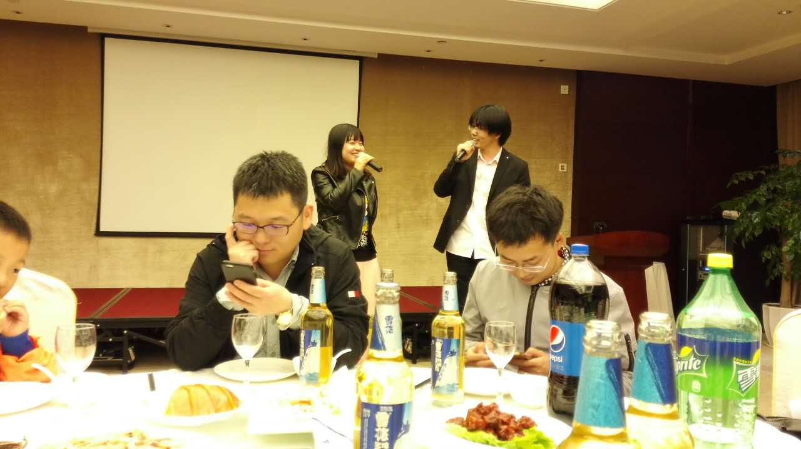
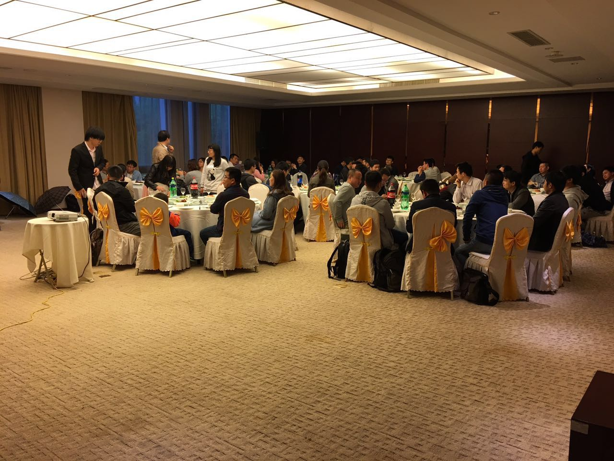
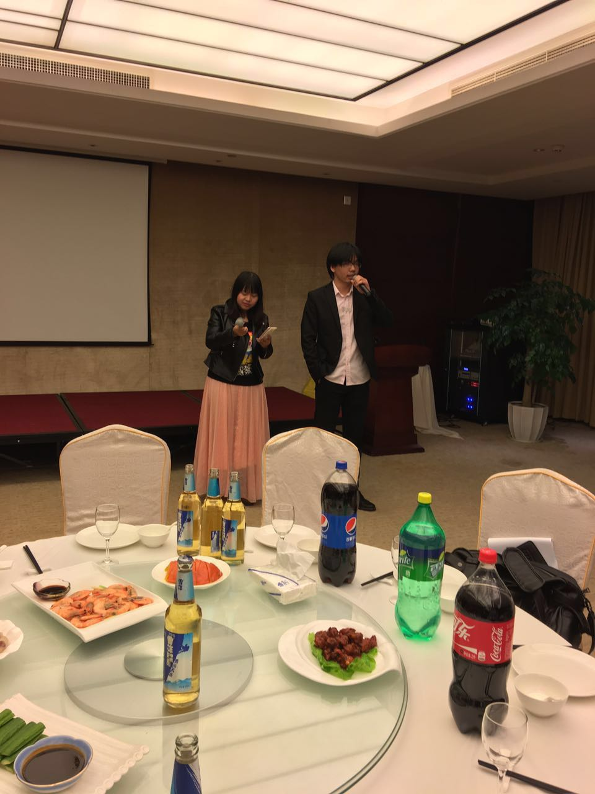
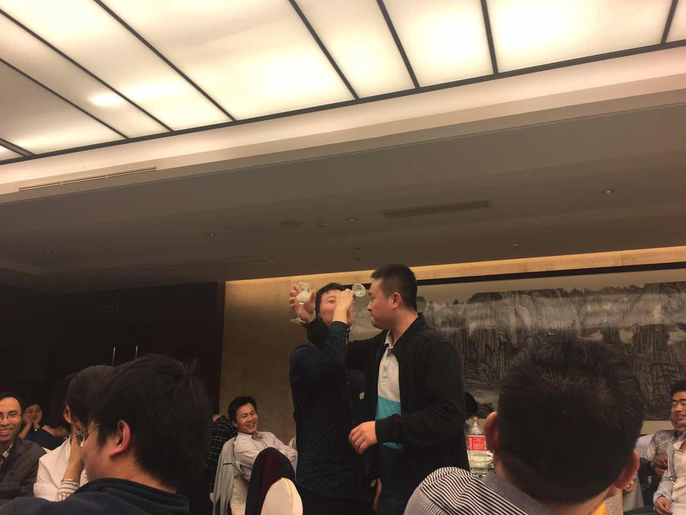
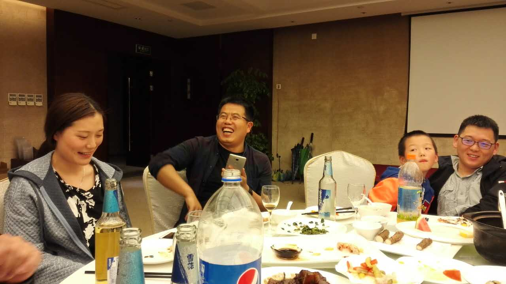

##秋游活动: 
* 日期:暂定9.24,25
* 目的:有了一定了解,进行户外拓展训练,增强内部凝聚力
* 目的地参考:石湖皮划艇,灵岩山灵白线,独墅湖攀岩馆攀岩

##夏日祭:48小时创业比拼
* 日期:暂定7月底,找个有空调的地方
* 目的:既然都是学软件的同学,大家组成小组,在48小时内做出一款app,从几个角度评比团队成果(也算是对项目管理课程的反馈),同时这种良性竞争有利于技法学习积极性,以及同学之间发掘人才。
* 活动参考:车库咖啡

##翻译活动:
* 日期:暂定冬天,一个月
* 目的:作为国内软件界的栋梁，中国梦的支撑者，要为后人，为了民族的未来出一份力,以南大2016届的名义,翻译一本前沿技术书籍, 每人分一些章节,作为同学们的共同成果,出版社这边王邢敏有熟人。
活动参考:无

-----------------------------------------------------------------------

##春游活动:
* 日期:暂定4.16
* 目的:初入同门,增进同学之间了解,偏向休闲腐败项目,带破冰活动节目
* 目的地:静斋酒店吃饭
* 状态:进行完了,人数,69
* 活动记录:

