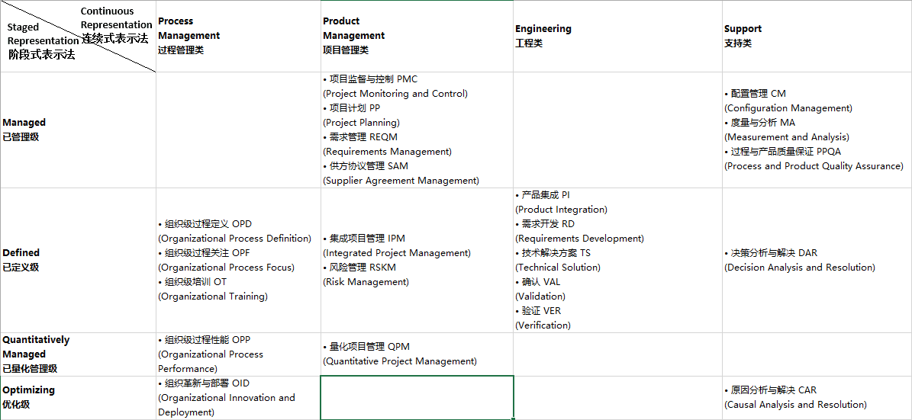

* [高乐乐同学整理的第一周笔记(请点我)](http://7xl0ck.com1.z0.glb.clouddn.com/%E8%BD%AF%E4%BB%B6%E5%B7%A5%E7%A8%8B%20%E7%AC%AC%E4%B8%80%E5%91%A8.pdf)  

* 江伟同学整理的4*4图:

  
* 钱劲同学整理的思维导图:
 

* [老师的课件v1.2](https://github.com/dfghj44444/NJUMENG2016/blob/master/CMMIUM7.pdf)  

* 高乐乐同学整理的相关资料:  
[在线查看](http://7xl0ck.com1.z0.glb.clouddn.com/%E8%BD%AF%E4%BB%B6%E9%A1%B9%E7%9B%AE%E7%AE%A1%E7%90%86.pdf)  
百度网盘下载:
http://pan.baidu.com/s/1boVMh6v  
在线协作地址:http://tburl.in/179as9i1/
